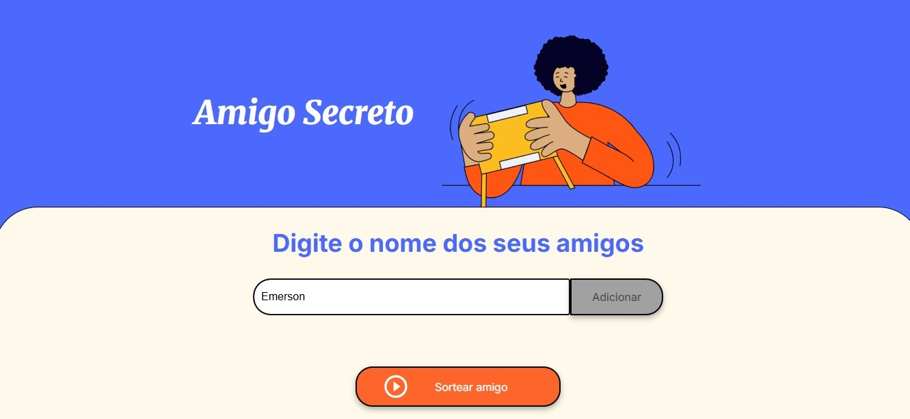
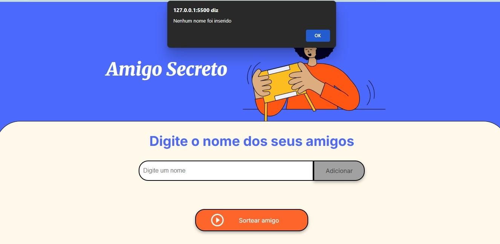
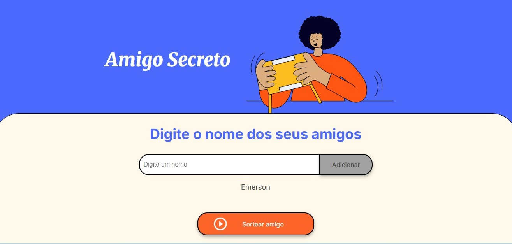
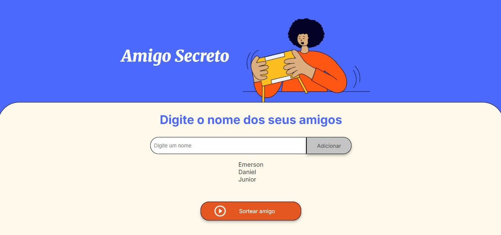
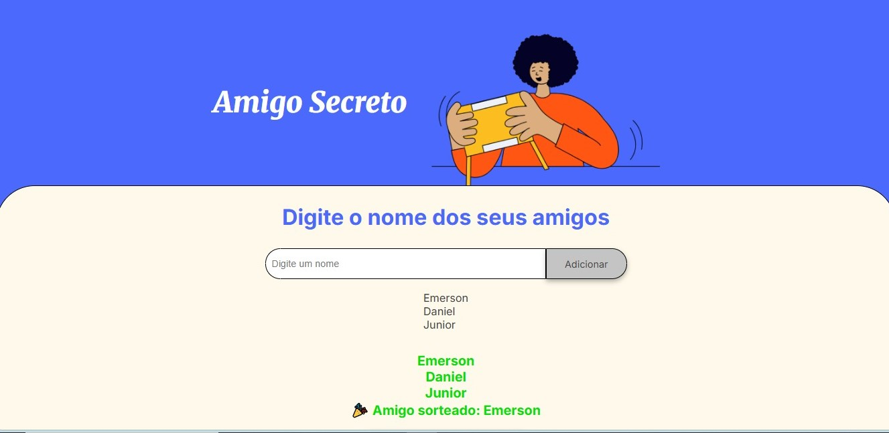

# 🎁 Projeto Amigo Secreto

Este é um projeto simples que consiste em adicionar amigos a uma lista e, em seguida, sortear um deles. Tudo é feito de forma simples e intuitiva.

## ✅ Funcionalidades:
- Adicionar nomes de amigos a uma lista
- Exibir a lista de amigos adicionados
- Validar se o campo de nome está vazio
- Sortear um amigo de forma aleatória
- Exibir o amigo sorteado na tela

## 🛠️ Tecnologias usadas:
- HTML
- CSS
- JavaScript

## ▶️ Como usar:
- Na tela, você verá um campo com o texto *"Digite um nome"*.

-O sistema avisa se você adicionar sem digitar nem um nome

 Digite o nome do amigo e clique no botão **Adicionar** para inseri-lo na lista.
 

- Você pode adicionar quantos amigos quiser. Os nomes adicionados aparecerão na tela para que você acompanhe quem já está na lista.

- Quando todos os nomes forem adicionados, clique no botão **Sortear Amigo**, e o nome sorteado será exibido em destaque.

